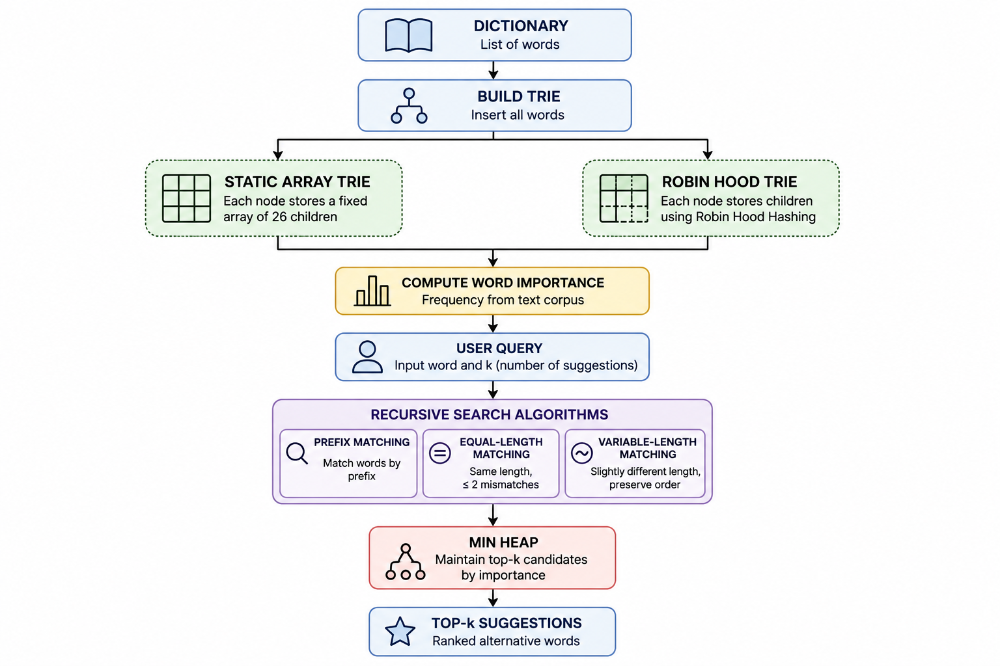
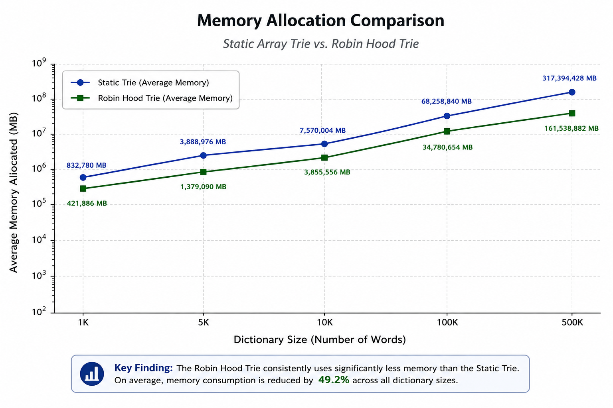

<div align="center">

# Word Suggestion System in Java

### Efficient word suggestion using Trie, Robin Hood Hashing, and Min-Heap

**Java • Data Structures • Algorithms • Recursion**

</div>

---

## Overview

This repository implements a **word suggestion system** in Java using the **Trie** data structure together with **Robin Hood Hashing** and a **Min-Heap** for efficient ranking of candidate words.

The application builds a dictionary from an input word list, computes word importance from a text corpus, and generates the top-**k** candidate suggestions using recursive Trie traversals and frequency-based ranking.

The project includes two independent Trie implementations:

- **Static Array Trie**
- **Robin Hood Hashing Trie**

Both implementations provide identical functionality while employing different internal storage strategies. Their memory consumption is experimentally evaluated and compared using dictionaries of various sizes.

*Experimental evaluation demonstrates that the Robin Hood Trie achieves substantially lower memory consumption than the Static Array Trie while providing identical functionality.*

---

## Features

- Efficient word suggestion using Trie data structures
- Two independent Trie implementations
- Robin Hood Hashing for memory-efficient child storage
- Recursive depth-first search algorithms
- Frequency-based ranking of candidate words
- Top-k suggestions maintained using a Min-Heap
- Experimental comparison of Trie memory consumption
- Clean object-oriented Java implementation

---

## Core Components

The system combines several classical data structures in order to achieve efficient word retrieval, ranking, and memory optimization.

### Trie

The Trie serves as the primary indexing structure of the application. Dictionary words are stored character by character, allowing common prefixes to be shared and enabling efficient recursive traversals.

### Static Array Trie

Each node maintains a fixed array containing one entry for every lowercase English letter. This approach provides constant-time child access but allocates memory for all possible children.

### Robin Hood Hashing Trie

Instead of storing a fixed array, each node maintains its children using **Robin Hood Hashing**, allocating memory only for existing transitions and significantly reducing memory consumption.

### Robin Hood Hashing

Robin Hood Hashing is an open-addressing collision resolution strategy that minimizes probe sequence variance by balancing displacement distances among stored elements, resulting in efficient lookups and improved space utilization.

### Min-Heap

Candidate suggestions are ranked according to their importance values. A Min-Heap continuously maintains the best **k** suggestions discovered during the recursive search.

---

## System Architecture

<p align="center">
  
</p>

<p align="center">
  <em>Figure 1. Overall architecture of the word suggestion system.</em>
</p>

---

## Algorithms

The application generates alternative words using three independent recursive algorithms.

### Prefix Matching

Returns all dictionary words whose prefix matches the input query.

```text
Input
so

Example Output
something
solution
solid
sort
souls
```

---

### Equal-Length Matching

Returns words having the same length as the input while differing by at most two characters.

```text
Input
so

Example Output
to
no
of
is
at
```

---

### Variable-Length Matching

Returns words whose length differs slightly from the input while preserving the relative ordering of characters.

```text
Input
so

Example Output
s
snow
soap
show
sold
also
```

---

## Complexity Analysis

Let:

- **n** = number of dictionary words
- **L** = average word length
- **m** = query length
- **h** = Trie height
- **k** = number of requested suggestions
- **S** = size of the explored subtree
- **V** = number of visited Trie nodes
- **N** = total number of Trie nodes
- **T** = total number of processed characters in the importance file

The overall complexity of the main operations is summarized below.

| Operation | Time Complexity | Space Complexity |
|-----------|----------------:|-----------------:|
| Dictionary Construction | **O(n · L)** | **O(n · L)** |
| Importance Computation | **O(T)** | **O(1)** |
| Prefix Matching | **O(m + S)** | **O(h)** |
| Equal-Length Matching | **O(V)** | **O(h)** |
| Variable-Length Matching | **O(N)** | **O(h)** |
| Heap Update | **O(log k)** | **O(k)** |

The reported complexities correspond to the asymptotic worst-case behavior of the implemented algorithms.

The practical performance depends on the explored portion of the Trie. Prefix matching usually visits only a small subtree, while variable-length matching explores a larger part of the dictionary.

---

## Experimental Evaluation

The project experimentally compares the memory consumption of the **Static Array Trie** and the **Robin Hood Trie** using dictionaries of various sizes.

For each experiment, randomly generated dictionaries were constructed and inserted into both implementations. Multiple executions were performed in order to compute the average memory usage.

The evaluation considers:

- Number of dictionary words
- Average word length
- Number of Trie nodes
- Total memory consumption

<p align="center">
  
</p>

<p align="center">
  <em>Figure 2. Average memory consumption of the Static Array Trie and Robin Hood Trie.</em>
</p>

### Key Finding

The Robin Hood Trie reduces memory consumption by approximately **50%** compared to the Static Array Trie while maintaining identical functionality and producing virtually the same number of Trie nodes.

<p align="center">
  <em>Figure 1. Average memory consumption of the Static Array Trie and Robin Hood Trie.</em>
</p>

The experimental results show that the Robin Hood Trie consistently requires substantially less memory than the Static Array Trie while preserving identical functionality across all tested dictionary sizes.

---

## Project Structure

```text
word-suggestion-system-java/
│
├── src/
│   └── datastructures/
│       └── wordsuggestion/
│           ├── Algorithms.java
│           ├── Element.java
│           ├── FileCreator.java
│           ├── MinHeap.java
│           ├── PartOne.java
│           ├── PartTwo.java
│           ├── RobinHoodHashing.java
│           ├── RobinHoodTrie.java
│           ├── RobinTrieNode.java
│           ├── SingleList.java
│           ├── StaticTrie.java
│           ├── TrieApplications.java
│           ├── UsefulNumbers.java
│           └── WordNode.java
│
├── data/
├── images/
│   ├── architecture.png
│   └── memory-comparison.png
├── report/
│   └──Report.pdf
│   └──ExperimentalResults.xlsx
├── README.md
├── LICENSE
└── .gitignore
```

---

## Running the Project

### Requirements

- Java 17 or later

### Compile

```bash
javac src/datastructures/wordsuggestion/*.java
```

### Example

```bash
java -cp src datastructures.wordsuggestion.PartOne dictionary.txt corpus.txt
```

The application builds the dictionary, computes word importance from the input corpus, and interactively generates the top-**k** word suggestions.

---

## Future Improvements

Possible future extensions include:

- Edit-distance based suggestions
- Unicode and multilingual dictionary support
- JUnit test suite
- Benchmark suite for execution time analysis
- Adaptive ranking based on user behavior
- Parallel Trie traversals

---

## License

This project is licensed under the **MIT License**.

---

<div align="center">

Developed by **Anastasis Zachariou**

</div>